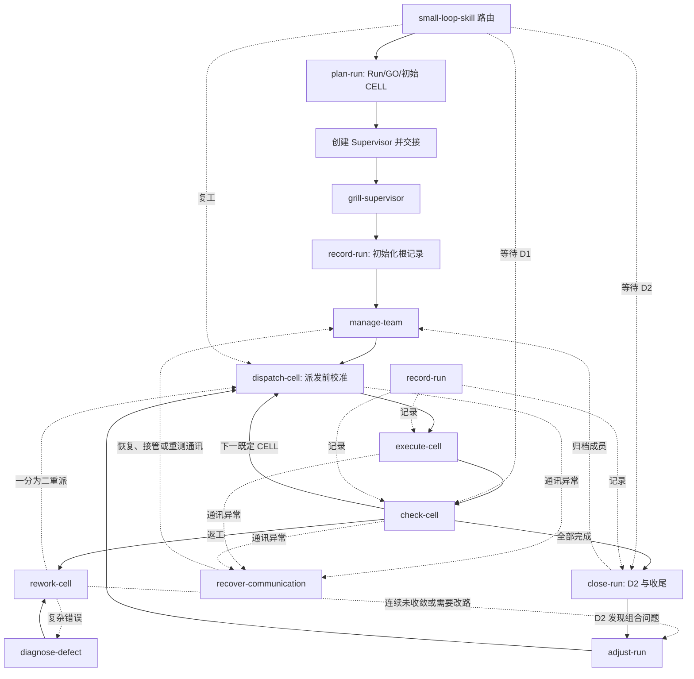

# SLK 3.0.0 轻量化 Skill 集合设计

日期：2026-08-22

状态：Owner 已批准，作为实施基线

范围：Small Loop Skill（SLK）3.0.0；现行 2.6.0 保持为可回退基线

## 1. 背景

SLK 2.6.0 已积累了角色隔离、分层检验、返工、通讯恢复、进度记录和模型选择等大量经验，但这些经验逐渐被写成了统一门禁、固定字段和强制验证。方法因此容易把普通施工偏差解释成“合理中断”，并花费大量上下文证明为何无法继续。

当前仓库的粗略规模为：主 `SKILL.md` 249 行、`SPEC.md` 270 行、references 434 行、templates 591 行、scripts 2,802 行、tests 6,693 行。一次宽泛词面扫描得到 1,241 个绝对或门禁式表达命中；这个数字不直接等于错误数量，但足以说明阅读和判断负担已经偏高。

本次优化的核心不是减少功能，而是改变经验的组织方式：

> 方法帮助 Agent 判断怎样继续，不替 Agent 制造停工理由。

## 2. 设计目标

- SLK 的身份、适用范围和角色边界保持清楚。
- Agent 进入 SLK 后先充分理解方法，再开始工程工作。
- 普通施工仅加载当前场景所需的少量指导。
- 异常、返工和恢复经验在相应情境出现时再加载。
- 建议保留 Agent 的工程判断空间，并为常见问题提供恢复方向。
- 每类判断形成一个默认归口，减少重复定义和互相冲突。
- Owner 最终看到简洁结论，同时可以从项目根目录的 Run 记录追查过程。

## 3. 非目标

- 本次设计不把 SLK 扩展到并行 Chain 或自由 GO 图。
- 本次设计不把 SLK 与 CLK、GLK 合并。
- 本次设计不把特定模型名称写入 SLK 内核。
- 本次设计不建立 Patrol、Heartbeat、后台调度器或隐藏 Agent。
- 本次设计不要求 Owner逐项确认检验结果。
- 本次设计采用 3.0.0，因为角色拓扑、检验层次和 Skill 组织方式均发生结构性变化。

## 4. SLK 内核

主 Skill `small-loop-skill` 保留以下正面定义：

1. SLK 面向中小型工程，或大型工程中相对独立的中小范围。
2. 一个 SLK 对应一个 Run；GO 与 CELL 按一条线性顺序推进。
3. 可见工程成员由 Supervisor、Checker、Worker 三个独立对话组成。
4. Supervisor 负责 Run 连续推进、规划调整和 Run 级 D2。
5. Checker 负责 CELL 派发、与 Worker 协作以及隔离执行 D1。
6. Worker 负责当前 CELL 的施工和最低程度 D0。
7. D0 提供交付前基本信心，D1 判断 CELL 是否达到约定目标，D2 判断全部成果合起来是否正确。
8. 项目根目录的 `SLK-RUN-<RUN-ID>.md` 汇总可读的工程记录。
9. 主 Skill 根据当前角色、阶段和事件，建议调用相应子 Skill。

主 Skill 以识别和路由为主。模型表、长表单、固定收据、异常全集、复杂验证脚本和具体施工技巧进入按需子 Skill 或退出方法内核。

## 5. 可见角色与通讯

正常协作关系为：

```text
Supervisor ↔ Checker ↔ Worker
```

创建关系为：

```text
原对话创建 Supervisor
Supervisor 创建 Checker
Checker 创建 Worker
```

创建下一级成员后，建议立即进行一次双向通讯测试。成员状态异常时，上一级成员优先恢复原成员或创建接管成员。Worker 多次无法联系 Checker 时，可以通过 Supervisor 协助恢复，形成应急路径：

```text
Worker → Supervisor → Checker
```

原对话在 Supervisor 接管后退出工程工作，保留 Owner 联系和 Supervisor 异常恢复入口。

正式成员采用项目中可见的 Codex 对话。创建和归档以实际任务 ID 与可观察状态为准，减少把文字声明、隐藏执行或错误对象当成正式成员的情况。消息是否送达可以结合目标对话中的内容、活动状态和回复判断，不额外制造纯确认消息。

推荐启动顺序为：Owner 与原对话选择 SLK、更新到适用的新版本、明确 Run 目标与边界；Agent 结合项目形成 Run/GO/CELL 和分层检查方案，再创建 Supervisor 并测试通讯、由 Supervisor 接管。Supervisor 读取方法并通过 Grill 后创建根记录和 Checker；Checker 接着创建 Worker。创建每一级成员后进行相邻成员双向通讯测试，随后补充 Supervisor 与 Worker 的应急通道测试。

Worker 遇到 Checker 通讯异常时，通常可以进行三次不同方式的唤醒尝试，并结合目标对话状态判断。仍未恢复时，建议把原交付信息和通讯情况发送给 Supervisor 协助处理。

## 6. 检验关系

- **D0 / Worker：** 施工交付前的最低程度自检，例如目标测试、构建或直接 smoke。它提供基本信心，不代替 Checker 判断。
- **D1 / Checker：** 在与 Worker 隔离的对话和适当环境中，对当前 CELL 的约定目标进行正式检查。
- **D2 / Supervisor：** 在全部 CELL 完成后，检查 GO 结果、相互衔接、端到端路径和主要风险，确认成果合起来正确。

Agent 在 Run 规划时根据项目目标、现有测试、可观察结果和相关检验 Skill 设计 D0、D1、D2。Owner 提供希望得到的结果和业务边界，不承担技术检查设计。实际检查方式可以根据进展和风险调整，并关注重复检验和资源消耗。

CELL 规划综合考虑默认 Worker 模型、电脑配置、施工复杂度和检查成本，并为意外依赖、测试和返工保留余量。派发前或 D1 返工中发现 CELL 明显过大、而原验收目标不变时，Checker 可以采用同一个简单办法：把 CELL 一分为二，形成两个串行 CELL并更新进度。连续两轮返工仍未收敛时，Checker 可以请 Supervisor 综合考虑继续诊断、调整路线、改变环境或暂时豁免。

## 7. Skill 集合

SLK 作为一组可组合 Skill 分发。主 Skill 与子 Skill 在安装后作为同级可发现 Skill 存在；“子 Skill”表示方法关系，不依赖嵌套目录自动调用。

### 7.1 正常流程 Skill

| # | Skill | 主要情境 | 推荐产出或后继 |
|---|---|---|---|
| 1 | `slk-plan-run` | Owner 选择 SLK 后、Supervisor 创建前 | Run/GO/初始 CELL、Agent 自行设计的克制分层检查，以及每个 CELL 的模型、电脑和余量依据 |
| 2 | `slk-grill-supervisor` | Supervisor 正式接管后 | 对方法理解的问答确认 |
| 3 | `slk-manage-team` | 建立、恢复、更换或归档成员时 | 可见成员、双向通讯状态或归档结果 |
| 4 | `slk-dispatch-cell` | Checker 准备交付既定 CELL 时 | 派发前现实校准，以及清楚的 CELL 目标、范围和 D1 标准 |
| 5 | `slk-execute-cell` | Worker 收到 CELL 后 | 候选成果、最低 D0、进度和风险 |
| 6 | `slk-check-cell` | Worker 提交候选后 | D1 PASS 或带具体方向的返工意见 |
| 7 | `slk-close-run` | 全部 CELL 完成后 | Supervisor 的 D2、最终记录、归档和 Owner 简报 |

### 7.2 按需支持 Skill

| # | Skill | 建议调用的情境 |
|---|---|---|
| 8 | `slk-record-run` | 各角色完成本轮工作、准备向下一对话传输前 |
| 9 | `slk-rework-cell` | D1 未通过，需要组织返工 |
| 10 | `slk-diagnose-defect` | 普通返工不足以解释复杂错误 |
| 11 | `slk-adjust-run` | CELL、模型、电脑、路线或豁免安排值得由 Supervisor 调整 |
| 12 | `slk-recover-communication` | 消息未送达、成员未被激活或通讯状态不明确 |

这 12 个名称是实现基线。初始 CELL 规划属于 `slk-plan-run`；派发前的现实校准属于 `slk-dispatch-cell`；施工中的较大变化属于 `slk-adjust-run`，避免出现第二套规划流程。

## 8. 子 Skill 之间的关系



正常路径保持线性。异常 Skill 作为旁路工具出现，处理完成后回到最接近的正常节点。

## 9. 子 Skill 编写标准

每个子 Skill 建议保持为一张轻量工作提示卡，通常包含：

1. **何时使用：** 描述具体情境。
2. **当前目标：** 说明这次调用要解决的问题。
3. **需要了解：** 列出少量必要输入。
4. **建议做法：** 提供经过验证的处理方向，并保留现场判断。
5. **完成后：** 给出简洁产出和推荐后继 Skill。

语言设计采用以下倾向：

- 方法身份使用正面陈述。
- 操作指导使用“在……情况下，建议……”的情境表达。
- 偏差描述同时给出恢复、调整或询问上一级成员的方向。
- 同类判断优先复用相应 Skill 的结果，减少多处重复解释。
- 安全、权限和 Owner 专属选择沿用外部真实边界，不通过方法文字扩大。

常见绝对词、门禁式表达和直接停工结论进入审阅提示清单。提示用于发现可能制造硬门槛的文字，并由设计者结合语境判断，不形成新的自动停工门禁。

## 10. 工程记录

Supervisor 在项目根目录创建一个 `SLK-RUN-<RUN-ID>.md`。Supervisor、Checker、Worker 分别记录自己的工作。每轮工作的建议顺序为：完成工作、写入记录、传输到下一对话。

记录保持工程上足够完整，包含目标、计划、成员 ID、CELL 进度、候选、D0/D1/D2、错误、返工、豁免、方案变化、证据位置、归档和最终结论。大体积原始日志保存在合适位置，根记录引用其路径或摘要。

D2 通过后，Supervisor 汇总记录，建议先归档 Worker，再归档 Checker，并在记录中写入实际归档状态。Supervisor 对话继续保留，方便 Owner 后续查询；最终给 Owner 的消息聚焦完工结论、D0/D1/D2结果、豁免数量和记录路径。

## 11. 连续施工导向

子 Skill 遇到异常时，优先建议以下方向：

- 补充信息或采用其他验证方式；
- 调整模型、电脑、环境或技术路线；
- Checker 将过大的 CELL 一分为二，并保留原验收目标；
- 由上一级成员恢复通讯或成员；
- 由 Supervisor 调整计划、决定豁免或联系 Owner。

外部权限、安全边界或现实资源确实尚未具备时，记录真实情况和已经尝试的替代路线。方法本身不把普通偏差包装成合规性停工。

## 12. 验证设计

### 12.1 已有真实失败作为基线

现行方法已经出现过以下可观察问题，可作为行为 RED 基线：

- Checker/Worker 通讯不稳定后工作停滞；
- Supervisor 在线等待成员，Run 缺少继续推进者；
- Patrol、Pin、模型绑定和容量门禁增加负担但未改善结果；
- 局部 fixture、字段或环境偏差被升级成整个工程停止；
- 检查范围和证据要求持续扩大，消耗大量 Token；
- Agent 使用规则证明中断合理，而不是寻找恢复路径。

### 12.2 新结构的行为场景

实现阶段为主 Skill 和每个子 Skill准备小型情境测试，观察 Agent 是否：

1. 在普通 Run 中理解SLK后进入第一项工程工作；
2. 在 CELL 过大且原验收目标不变时，由 Checker 一分为二并继续派发；
3. 在 D1 失败时组织返工和具体修复；
4. 在通讯异常时尝试恢复并请上一级协助；
5. 在多次返工后由 Supervisor综合选择后续路线；
6. 在 D2 发现组合问题时回到相关 CELL，而非重复全部检查；
7. 在真实 Owner 权限问题出现时提出清楚、最小的问题；
8. 在普通偏差出现时保持 Run 可继续。

测试同时关注上下文用量、重复读取和 Skill 路由数量。目标是让常见场景只加载主 Skill 与少量相关子 Skill。

## 13. 迁移与回退

- 2.6.0 的 tag、Release 和历史内容保持不变，作为可回退基线。
- 新结构在独立分支逐个 Skill实现和验证。
- 每次先验证一个 Skill 的真实情境，再进入下一个 Skill。
- 新集合通过整体正常流程、返工、恢复和收尾测试后，再规划版本、安装和发布。
- 旧模板、脚本和合同在确认没有新结构消费者后再逐步退出，减少一次性删除带来的误伤。

## 14. 成功标准

新SLK达到以下结果时，可进入发布评估：

- 新Agent能用较短阅读理解SLK身份和三角色关系；
- Supervisor通过Grill后能够建立成员组并持续推进Run；
- 正常CELL循环不加载异常处理全集；
- 常见失败触发恢复、返工或调整建议，而不是方法生成的停工结论；
- D0、D1、D2职责清楚且没有重复检验层；
- 工程记录能够回答做了什么、检查了什么、返工或豁免了什么、最终为何通过；
- 子Skill之间没有重复定义同一关键判断；
- 现行2.6.0仍可独立获取和恢复。
